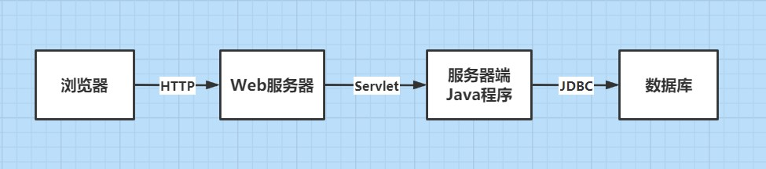
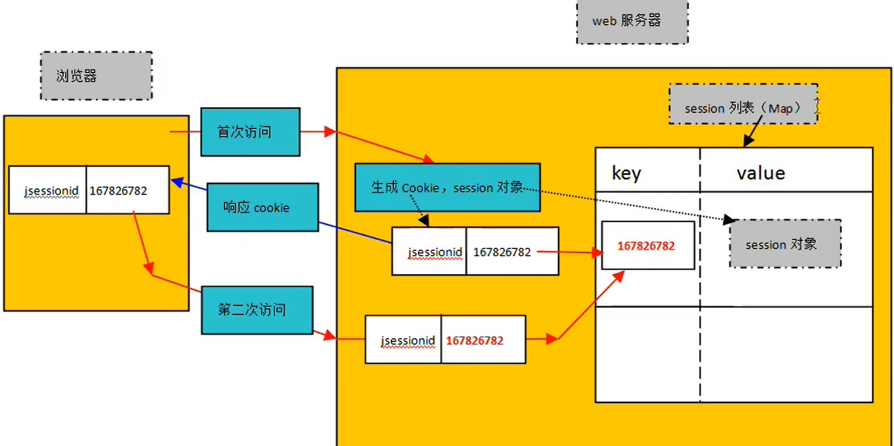

# Servlet

**什么是Java EE ?**

一个超级庞大的Java内部库，在这个库的基础上完成企业级的开发。

**什么是API ？包括什么 ？**

API：应用程序编程接口（这里的接口不是interface）

包括：源码、字节码、帮助文档

**Servlet相关接口的字节码在哪 ？**

Tomcat的lib目录下的servlet-api.jar

## B/S 架构

1. 系统架构分类：
   - C/S Client - Server

   - B/S Browser - Server（B/S本质上还是C/S，客户端是浏览器的情况）
2. B/S 架构的优缺点：
   - 优点：
     -  不需要安装客户端软件，只要有浏览器就行
     -  升级只需要升级服务器端，升级方便
   - 缺点：
     - 所有数据全部集成在服务器端，一旦发生问题，数据丢失严重
     - 速度慢
3. B/S 架构访问过程：
   - 装有Tomcat软件服务器的机器是硬件服务器
   - Browser（URL）$\rightarrow$ Tomcat（Tomcat就是访问的服务器，访问的内容可以是静态资源，也可以是动态资源）

**什么是Servlet ？**

开发webapp和web容器的规范就是Servlet

**JDBC和Servlet的区别 ？**

JDBC接口我们是调用者，Servlet接口我们是实现者（等待Tomcat中的main方法去调用我们写的类）

4. B/S 架构角色和协议：



## Servlet

### Servlet本质

Java EE 规范：Servlet规范

Servlet接口是Servlet规范中的核心接口

*注：编写服务器端 Java程序时，必须实现 Servlet接口*

**Tomcat是什么 ？**

- WebServer（Web服务器）

- Web Container（Web 容器）

*注：环境变量必须要配置 JAVA_HOME*


**xml配置文件作用 ？**

- 将用户请求路径和服务器 Java程序（类）绑定在一起

- Tomcat读取xml文件，通过key获取value（value为字符串，即全限定类名），并通过反射机制创建对象

### Tomcat服务器目录

- bin：启动、关闭服务器等命令
- conf：配置文件（\*.properties、\*.xml）
- lib：库文件（*.jar）
- logs：日志文件
- temp：临时文件
- webapps：web项目
- work：JS相关文件

*注：Servlet规范要求 webapps里的 web项目必须有一个 WEB-INF文件夹，WEB-INF下必须有 classes、lib文件夹和 web.xml文件（请求路径和 Servlet配置）*

### web.xml

- 一个webapp只有一个web.xml文件

- web.xml主要配置请求路径和Servlet类名之间的绑定关系

- web.xml在Tomcat服务器启动阶段被解析

- 文件中的主要标签

  ```xml
  <?xml version="1.0" encoding="UTF-8"?>
  <web-app xmlns="http://xmlns.jcp.org/xml/ns/javaee"
    xmlns:xsi="http://www.w3.org/2001/XMLSchema-instance"
    xsi:schemaLocation="http://xmlns.jcp.org/xml/ns/javaee
                        http://xmlns.jcp.org/xml/ns/javaee/web-app_4_0.xsd"
    version="4.0">
      <servlet>
      	<servlet-name></servlet-name>
      	<!--实现Servlet接口的类名-->
      	<servler-class></servler-class>
  	</servlet>
  	<servlet-mapping>
      	<servlet-name></servlet-name>
      	<!--这个路径是一个虚拟路径，代表一个资源的名称，可以编写多个-->
      	<url-pattern></url-pattern>
      	<url-pattern></url-pattern>
  	</servlet-mapping>
  </web-app>
  ```

### Servlet对象生命周期

1. 什么是生命周期 ？

   一个java对象从最初创建到最终销毁，经历的所有过程

2. Servlet对象的生命周期由谁管理 ？

   Servlet对象的生命周期，以及Servlet对象的相关方法的调用，javaweb程序员无权干涉。

   Servlet对象的生命周期由web容器（Tomcat）来管理

3. **默认情况下**， Servlet对象在web服务器启动阶段不会被实例化（特殊设置可以实现启动阶段实例化）

4. 描述Servlet对象生命周期：

   - 用户在浏览器地址栏输入URL
   - web容器截取请求路径
   - web容器在容器上下文中找请求路径对应的Servlet对象
     - 若没有找到对应的Servlet对象：
       - web容器通过web.xml文件相关配置信息，得到请求路径对应的Servlet完整类名
       - 通过反射机制，调用Servlet类的无参数构造方法完成Servlet对象的实例化
       - web容器调用Servlet对象的init方法完成初始化操作
       - web容器调用Servlet对象的service方法提供服务
     - 若找到对应的Servlet对象：
       - web容器直接调用Servlet对象的service方法提供服务
   - web容器关闭的时候/webapp重新部署的时候/该Servlet对象长时间没有用户访问的时候，web容器会将该Servlet对象销毁，在销毁该对象之前调用Servlet对象的destroy方法

5. **“单实例，多线程”**，多个线程共享一个Servlet对象

*注：不建议在 Servlet对象中使用实例变量（线程安全问题），尽量使用局部变量*

6. Servlet对象在web服务器启动阶段实例化

   需要在web.xml文件中进行相关配置

   ```xml
   <servlet>
       <!--自然数“1”越小，优先级越高-->
       <load-on-startup>1</load-on-startup>
   </servlet>
   ```

7. Servlet对象在实例化之后被存储到哪里了 ？

   大多数web容器都是将Servlet对象以及其对应的url-pattern存储到Map集合中

   在web容器中有这样一个Map集合：Map<String, Servlet>

   | key     | value                 |
   | ------- | --------------------- |
   | /login  | LoginServle对象引用   |
   | /delete | DeleteServlet对象引用 |
   | /save   | SaveServlet对象引用   |

8. web服务器在启动的时候就会解析各个webapp的web.xml文件，做了什么 ？

   将url-pattern以及其对应的Servlet完整类名存储到Map集合中

   Map<String, String>

   | key     | value                             |
   | ------- | --------------------------------- |
   | /login  | com.javaweb.servlet.LoginServle   |
   | /delete | com.javaweb.servlet.DeleteServlet |
   | /save   | com.javaweb.servlet.SaveServlet   |

### ServletConfig接口

Apache Tomcat服务器实现了Servlet规范，Tomcat服务器专门写了一个ServletConfig的实现类，实现类的完整类名：org.apache.catalina.core.StandardWrapperFacade

**ServletConfig是什么 ？**

ServletConfig是一个Servlet对象的配置信息对象，封装了Servlet对象的配置信息。Servlet对象的配置信息在web.xml中

**getServletConfig()方法是做什么的 ？**

这个方法供子类使用，在子类中获取ServletConfig（属性私有，方法公有）

**ServletConfig接口中的常用方法**

```java
// 通过配置信息初始化参数的name获取参数的value
String getInitParameter(String name)
// 获取配置信息中初始化参数的name，Enumeration是一个泛型集合
Enumeration getInitParameterNames()
// 获取servlet-name
String getServletName()
// 获取ServletContext【Servlet上下文】对象
ServletContext getServletContext()
```

```xml
<servlet>
    <!--配置信息的初始化参数，可以有多个-->
    <init-param>
        <param-name></param-name>
        <param-value></param-value>
    </init-param>
</servlet>
```

### ServletContext接口

Tomcat服务器对ServletContext接口的实现类的完整类名：org.apache.catalina.core.ApplicationContextFacade

**ServletContext是什么 ？**

- ServletContext是Servlet上下文
- 一个webapp只有一个ServletContext对象
- ServletContext在服务器启动阶段被实例化，在服务器关闭时被销毁
- ServletContext对应的是web.xml文件，是web.xml文件的代表
- 所有用户若要共享一个数据，可以将该数据放到ServletContext对象中。一般放入ServletContext对象的数据是不建议修改的（ServletContext对象可以多线程访问，存在线程安全问题）

**ServletContext接口中的常用方法**

```java
// 从ServletContext范围中获取数据
Object getAttribute(String name)
// 添加数据
void setAttribute(String name, Object object)
// 移除数据
void removeAttribute(String name)

// 获取所有上下文初始化参数的name
Enumeration getInitParameternames()
// 通过上下文初始化参数的name获取value
String getInitParameter(String name)

// 获取文件绝对路径
String getRealPath(String path)
```

```xml
<!--web.xml文件中配置上下文参数，这些信息被自动封装到ServletContext对象中-->
<context-param>
    <param-name></param-name>
    <param-value></param-value>
</context-param>
```

**Servlet、ServletConfig、ServletContext之间的关系**

- 一个Servlet对应一个ServletConfig

- 所有Servlet共享一个ServletContext对象

### webapp默认页面设置

```xml
<welcome-file-list>
    <!--默认页面可以设置多个，越靠上，优先级越高-->
    <!--welcome-file可以是servlet-name-->
    <welcome-file>login.html</welcome-file>
    <!--若login.html不存在，则访问welcome.html-->
    <welcom-file>welcome.html</welcom-file>
</welcome-file-list>
```

*注：若文件名为 index.html，则为默认页面，因为在 Tomcat服务器目录下 conf文件中 web.xml已经配置了（全局配置）*

### 适配器（缺省适配器模式）

作用：

- 为了Servlet接口的实现类不用实现接口中的所有方法，可能该实现类只需要service方法
- 适配器除了可以让代码优雅之外，还可以在适配器中提供大量的方法，子类继承之后，可以直接在子类使用，方便编程

```java
// 适配器抽象类实现Servlet接口，将LoginServlet需要继承实现的方法作为抽象方法
abstract class Adapter implements Servlet {}
class LoginServlet extends Adapter {}
```

SUN公司提供的适配器类：javax.servlet.GenericServlet

只需要重写service方法，如果要重写init(ServletConfig config)方法，则直接重写init()方法

*注：init()为 GenericServlet中重载的方法*

### HTTP协议

**HTTP协议常见错误状态码**

404 - Not Found（资源未找到，请求的资源路径写错了）

405 - HTTP method GET/POST is not supported by this URL（请求方式错误）

500 - Server Inner Error（服务器内部错误，一般是java程序出现异常）

自定义出错页面提示：

```xml
<error-page>
    <!--错误状态码-->
    <error-code></error-code>
    <!--跳转地址-->
    <location></location>
</error-page>
```

**HTTP协议的详细内容**

1. 什么是HTTP协议：

   - 超文本传输协议
   - 浏览器和服务器之间的一种通信协议
   - 该协议由W3C负责制定，本质上是数据传送格式的约定。浏览器和服务器都必须按照这种数据格式进行接收和发送

2. HTTP协议的版本号：HTTP 1.1

3. HTTP协议包括几部分：

   - 请求协议：Browser $\rightarrow$ Server

   - 响应协议：Server $\rightarrow$ Browser

4. 请求协议：
   - 请求行：请求方式 URI 协议版本号
   - 消息报头
   - 空白行：分离消息报头和请求体
   - 请求体

5. 响应协议：
   - 状态行：协议版本号 状态码 状态描述信息
   - 响应报头
   - 空白行：分离响应报头和响应体
   - 响应体

**GET请求和POST请求的区别**

- POST请求在请求体（data）中提交数据，所以POST请求提交的数据没有长度限制
- GET请求在请求行（uri?name=value&id=value）上提交数据，所以GET请求提交的数据长度有限制
- GET请求只能提交字符串数据，POST请求可以提交任何类型的数据
- GET请求最终的结果，会被浏览器缓存，而POST不会
- 直接在浏览器地址栏输入访问地址是GET请求

*注：一般情况下，GET请求是从服务器中读取数据，而 POST请求是为了修改或提交数据*

### HttpServlet

**HTTP的请求协议全部信息被自动封装到javax.servlet.http.HttpServletRequest对象中，HttpServletRequest是一个接口，继承了ServletRequest**

封装一个类HttpServlet，继承GenericServlet，来保证前端请求方式和后台程序处理方式一致

```java
pubilc class HttpServlet extends GenericServler {
    @override
    pubilc void service(ServletRequest req, ServletResponse res){
        HttpServletRequest request = (HttpServletRequest) req;
        HttpServletResponse response = (HttpServletResponse) res;
        service(request, response);
    }
    
    protected void service(HttpServletRequest request, HttpServletResponse response) {
        String method = request.getMethod();
        // 若子类重写了doGet/doPost方法，则调用子类的doGet/doPost方法，否则调用父类的doGet/doPost方法
        // 父类的doGet/doPost方法会响应405错误（请求方式不支持）
        if ("GET".equals(method)) {
            doGet(request, response);
        } else if ("POST".equals(method)) {
            doPost(request, response);
        }
    }
    
    protected void doGet(HttpServletRequest request, HttpServletResponse response) {
        // 提示请求方式错误，应该使用POST请求
    }
    
    protected void doPost(HttpServletRequest request, HttpServletResponse response) {
        // 提示请求方式错误，应该使用GET请求
    }
}
```

SUN公司已经提供了上述HttpServlet类：javax.servlet.http.HttpServlet

HttpServlet体现的设计模式：模板方法设计模式（父类提供模板方法，子类完成具体实现）

**我们需要完成的：**

```java
public class LoginServlet extends HttpServlet {
    // 访问资源路径首先会执行父类HttpServlet中的service()
    // 下面的方法只实现其一，GET请求就实现doGet()，POST请求就实现doPost()
    doPost() {}
    doGet() {}
}
```

### HttpServletRequest

javax.servlet.http.HttpServletRequest接口

1. HttpServletRequest是一个接口，Servlet规范中重要接口之一

2. 继承关系：父类 ServletRequest

3. 封装信息：

   - 请求方式

   - URI

   - 协议版本号

   - 表单提交的数据

     . . .

4. HttpServletRequest接口的实现类是web容器负责实现的，Tomcat服务器有自己的实现，我们只需要面向接口调用方法即可

5. HttpServletRequest对象代表一次请求，每个请求都对应一个HttpServletRequest对象，所以该对象的生命周期是短暂的

6. HttpServletRequest接口中常用方法：


```java
/*
* 获取表单数据
*/

// name属性规定了input元素的名称，用于对提交到服务器后的表单数据进行标识，只有设置了name属性的表单元素才能在提交表单时传递它们的值
// 通过key获取value这个一维数组中的首元素
// 这个key可以是GET请求中url的参数；也可以是POST请求中请求体的参数，但是请求体的数据格式必须是表单格式，即application/x-www-form-urlencoded;charset=utf-8
String getParameter(String name)
// 获取整个Map集合
Map getParameterMap()
// 获取整个Map集合的所有key
Enumeration getParameterNames()
// 通过Map集合key获取value
String[] getParameterValues(String name)
```

```java
// 获取上下文路径（webapp根路径）
String getContextPath()
// 获取浏览器请求方式
String getMethod()
// 获取请求的URI
String getRequestURI()
// 获取请求的URL
StringBuffer getRequestURL()
// 获取Servlet PATH url-pattern
String getServletPath()
// 获取客户端IP地址
String getRemoteAddr()
```

```java
/*
* 操作request上下文（HttpServletRequest）
*/

/*
HttpServletRequest是一个怎样的范围？
HttpServletRequest类型的变量通常命名为：request，代表当前的本次请求，一次请求对应一个request对象，请求范围是极小的，request只能完成在同一次请求中传递数据
*/

// 从request范围中获取数据
Object getAttribute(String name)
// 添加数据
void setAttribute(String name, Object object)
// 移除数据
void removeAttribute(String name)
```

#### 处理特殊的请求体和响应体内容

**ServletInputStream**

public abstract class ServletInputStream extends InputStream 

```java
// 读取客户端的请求信息的输入流
ServletInputStream inputStream = request.getInputStream();
byte[] bytes = new byte[1024];
int len = 0;
String data = null;
while ((len = inputStream.read(bytes)) != -1 ) { // read(byte[] bytes)方法每次从数据源中读取一个byte并返回,文件流结束返回-1
    data = new String(bytes, 0, len);
}
inputStream.close();
```

**ServletOutputStream**

public abstract class ServletOutputStream extends OutputStream

```java
// 利用这个输出流可以将数据返回到客户端
// 例如将图片加载到浏览器端
// 设置响应的格式
response.setContentType("image/jpg");
// 使用response获得字节输出流
ServletOutputStream out = response.getOutputStream();
// 获得服务器上的图片
String realPath = this.getServletContext().getRealPath("a.jpg");
InputStream in = new FileInputStream(realPath);
int len = 0;
byte[] buffer = new byte[1024];
while((len = in.read(buffer)) > 0 ) {
	out.write(buffer, 0, len);
}
in.close();
out.close();
```

#### <span id="jump">转发</span>

执行完AServlet之后，跳转到BServlet执行，将AServlet执行和BServlet执行放到同一个请求中，必须使用转发技术

```java
// 获取请求转发器，让转发器对象指向某个资源（让该资源共享request对象）
RequestDispatcher getRequestDispatcher(String path)
// 转发
request.getRequestDispatcher(path).forward(request,response)
```

**关于范围对象的选择：**

ServletContext：应用范围，可以跨用户传递数据

ServletRequest：请求范围，只能在同一个请求中传递数据（可以跨Servlet对象传递数据，但是这多个Servlet必须在同一个请求中，通过请求转发器实现）

#### 程序中乱码解决方案

1. 显示到网页上的数据出现中文乱码

   - 经过执行java程序之后，java程序负责向浏览器响应时，出现中文乱码：

     设置响应的内容类型，以及对应的字符编码方式：`response.setContentType("text/html;charset=UTF-8")`

   - 没有经过执行java程序，而是直接访问html页面，出现中文乱码：

     `<meta content="text/html;charset=UTF-8">`

2. 将数据从浏览器发送给服务器时，服务器接收到的数据是乱码

   *注：不管是哪个国家的文字，在浏览器发送给服务器时，都会采用 ISO-8859-1的编码方式发送*

   - 第一种解决方案：万能方案，既能解决POST请求乱码，又能解决GET请求乱码

     先将服务器中接收到的数据采用ISO-8859-1的方式编码，回归原始状态，再给定一种支持简体中文的编码方式重新编码，但是这个编码方式必须和浏览器编码方式一致

     ```java
     // data是服务器接收的字符串数据
     byte[] bytes = data.getBytes("ISO-8859-1"); // 解码
     data = new String(bytes,"UTF-8"); // 编码
     ```

   - 第二种解决方案：只适合POST请求，只对**请求体**编码
   
     `request.setCharacterEncoding("UTF-8")`
   
   - 第三种解决方案：只适合GET请求，只对**请求行**编码
   
     修改CATALINA_HOME/conf/server.xml文件（CATALINA_HOME就是tomcat根目录）
   
     ```xml
     <Connector port="8080" protocol="HTTP/1.1"
                    connectionTimeout="20000"
                    redirectPort="8443"
                    URIEncoding="UTF-8"/>
     ```
#### Servlet线程安全

**什么时候程序存在线程安全问题 ？**

- 多线程并发
- 有共享的数据
- 共享数据有修改操作

**在JVM中，哪些数据可能会存在线程安全问题 ？**

- 局部变量内存空间不共享，一个线程一个栈

- 所有线程共享一个堆

  new出来的对象在堆中存储，对象内部有实例变量，实例变量多线程共同访问

- 所有线程共享一个方法区

  方法区中有静态变量，静态变量的内存也是多线程共享

**数据库中的线程安全**

当多个线程共享同一张表，并且同时去修改表中的一些记录，那么这些记录就存在线程安全问题

解决方案：

1. java程序中使用synchronized关键字，线程同步
2. 事务隔离级别，例如：串行化
3. 行级锁（悲观锁）、乐观锁

**如何解决Servlet线程安全问题 ？**

1. 不使用实例变量，尽量使用局部变量
2. 若必须使用实例变量，由于Servlet是单例的（多个线程的请求都用同一个Servlet对象来处理），所以只能考虑使用synchronized，线程同步机制

*补充：什么是单例、多例 ？ 单例就是所有的请求都用一个对象来处理，而多例则是每个请求用一个新的对象来处理*

#### 转发和重定向

**web系统中资源跳转的两种方式：**

- [转发 - forward](#jump)
- 重定向 - redirect

**重定向**

`response.sendRedirect(path)`

将path路径**响应**给浏览器，浏览器**自动**又向服务器发送了一次**全新的请求**（重定向原理）

*注：这个 path与转发不同*

**转发与重定向的不同点**

- 转发是request对象触发的；重定向是response对象触发的
- 转发是一次请求，浏览器地址栏上的地址不会变化；重定向是两次请求，浏览器地址栏上的地址发生变化
- 重定向的路径需要加webapp的根路径
- 转发是在项目内部完成资源跳转；重定向可以完成跨webapp跳转资源

**重定向解决浏览器刷新问题**

### HttpServletResponse

javax.servlet.http.HttpServletRequest接口，是ServletResponse的子接口

**HttpServletResponse接口中的常用方法：**

```java
// 设置响应的状态码
setStatus(int sc)
// 设置响应头
setHeader(String name, String value)
// 设置响应体（字符流）
// 通过字符流的write(String s)方法可以将字符串设置到response缓冲区中，随后Tomcat会将response缓冲区中的内容组装成HTTP响应返回给浏览器端
PrintWriter getWriter()
// 设置响应体（字节流）
// 通过字节流的write(byte[] bytes)方法可以将字节内容设置到response缓冲区中
// 可以实现浏览器端的文件下载（图片解析）
ServletOutputStream getOutputStream()
```

### Cookie

1. Cookie是什么 ？
   - Cookie可以保留会话状态，但是这个状态是保留在客户端上，只要Cookie清除，或者Cookie失效，这个会话状态就没有了
   - Cookie可以保存在浏览器的缓存中，浏览器关闭Cookie失效，Cookie也可以保存在客户端的硬盘文件中，浏览器关闭Cookie还在，除非Cookie失效

*注：HTTP是无状态协议，协议对于事务处理没有记忆能力*

2. java程序中怎么创建Cookie ？

   `Cookie cookie = new Cookie(String cookieName, String cookieValue)`

3. 服务器可以一次向浏览器发送多个Cookie，默认情况下，服务器发送Cookie给浏览器之后，浏览器将Cookie保存在缓存中，只要不关闭浏览器，Cookie永远存在，并且有效，当浏览器关闭，缓存中的Cookie被清除

   `response.addCookie(Cookie cookie)`

4. 在浏览器客户端保存的Cookie，什么时候会再次发送给服务器 ？

   请求路径和Cookie是紧密关联的，不同的请求路径会发送提交不同的Cookie

5. 默认情况下，Cookie和哪些路径绑定在一起 ？

   和请求路径的上级路径。例如：/javaweb/test/loginServlet 请求服务器，服务器生成Cookie，并将Cookie发送给浏览器客户端，浏览器会默认和"test/"这个路径绑定在一起，也就是说，以后只要发送"test/"请求，Cookie一定会提交给服务器

6. Cookie和某个特定的路径绑定

   `cookie.setPath(String path)`

7. 默认情况下，没有设置Cookie的有效时长，该Cookie被默认保存在浏览器的缓存当中。我们可以通过设置Cookie的有效时长，以保证Cookie保存在硬盘文件中（有效时长必须大于0）

   `cookie.setMaxAge(int expiry)`

   有效时长expiry单位为秒

8. 服务器接收浏览器提交的Cookie

   从request对象中获取所有提交的Cookie

   ```java
   Cookie[] cookies = request.getCookies();
   if (cookies != null) {
       for (cookie in cookies) {
           String name = cookie.getName();
           String value = cookie.getValue();
       }
   }
   ```

**Cookie实现七天内免登录**

```xml
<!--需要一个CheckLoginServlet来判断是否免登录-->
<!--后端程序判断后再完成页面跳转，防止用户直接访问登录页面-->
<welcome-flie-list>
    <welcome-file>isLogin</welcome-file>
</welcome-flie-list>
<servlet>
    <servlet-name>isLogin</servlet-name>
    <servler-class>com.javaweb.servlet.CheckLoginServlet</servler-class>
</servlet>
<servlet-mapping>
    <servlet-name>isLogin</servlet-name>
	<url-pattern>/isLogin</url-pattern>
</servlet-mapping>
```

如果cookie的value与数据库的值相匹配，则直接跳转首页，否则跳转登录页面

### Servlet路径编写总结

1. 路径的编写形式：

   - `<a href="/项目名/资源路径"></a>`

   - `<form action="/项目名/资源路径"></form>`

   - 重定向：`response.sendRedirect("/项目名/资源路径")`

   - 转发：`request.getRequestDispatcher("/资源路径").forward(req,res)`

   - 欢迎页面：

     ```xml
     <welcome-file-list>
         <welcome-file>资源路径</welcome-file>
     </welcome-file-list>
     ```

   - Servlet路径：
   
     ```xml
     <servlet-mapping>
         <servlet-name></servlet-name>
         <url-pattern>/资源路径</url-pattern>
     </servlet-mapping>
     ```
   
   - Cookie设置path：`cookie.setPath("/项目名/资源路径")`
   
   - ServletContext：
   
     ```java
     ServletContext application = config.getServletContext();
     application.getRealPath("/资源路径");
     ```

### HttpSession

javax.servlet.http.HttpSession接口

**Cookie将会话状态保存在客户端，HttpSession将会话状态保存在服务器端**

1. 什么是一次会话 ？

   用户打开浏览器，在浏览器上发送多次请求，直到最终关闭浏览器，表示一次完整的会话

2. 在会话进行过程中，web服务器一直为当前这个用户维护着一个HttpSession对象（会话级别对象），一次会话对应一个HttpSession对象

   ```java
   // 获取当前的session，获取不到，则新建session
   HttpSession session = request.getSession();
   // 获取当前的session，获取不到，则新建session
   HttpSession session = request.getSession(true);
   // 获取当前的session，获取不到，则返回null
   HttpSession session = request.getSession(false);
   ```

**Session实现原理：**

Session的实现与Cookie密切相关

- 打开浏览器，在浏览器上发送首次请求
- 服务器会创建一个HttpSession对象，该对象代表一次会话
- 同时生成HttpSession对象对应的Cookie对象，并且Cookie对象的name是JSESSIONID，Cookie的value是32位长度的字符串
- 服务器将Cookie的value和HttpSession对象绑定到session的列表中
- 服务器将Cookie完整发送给浏览器客户端
- 浏览器客户端将Cookie保存到缓存中
- 当再次发送请求时，会自动提交缓存中的Cookie
- 服务器收到Cookie，验证Cookie的name确实是：JSESSIONID，然后自动获取该Cookie的value
- 通过Cookie的value去session列表中检索对应的HttpSession对象



*注：浏览器关闭之后，服务器不会销毁 session对象。session默认超时时间为 30分钟，若超时， session对象会自动销毁*

```xml
<session-config>
    <!--120分钟内没有用户访问该session对象，自动销毁-->
    <session-timeout>120</session-timeout>
</session-config>
```

**HttpSession接口的常用方法：**

```java
// 从session范围中获取数据
Object getAttribute(String name)
// 添加数据
void setAttribute(String name, Object object)
// 移除数据
void removeAttribute(String name)
// 将session设置为失效，一般在退出时使用
// session失效的同时，浏览器会立即创建一个新的session
void invalidate()
```

**三个范围比较**

application(应用范围) > session(会话范围) > request(请求范围)

- application完成跨会话共享数据
- session完成跨请求共享数据，但是这些请求必须在同一个会话当中
- request完成跨Servlet共享数据，但是这些Servlet必须在同一个请求当中（转发）

**登录成功之后，登录成功的这个状态可以保存到session对象中（用户级别）**

```java
// 创建session对象
HttpSession session = request.getSession();
// 保存登录状态
session.setAttribute("user", User);
```

验证登录状态：

```java
// 获取session对象
HttpSession session = request.getSession(false);
if (session != null && session.getAttribute("user") != null) {
    // 执行登录后才允许的操作
}
```

## 数据交互

阿里巴巴开源的json解析框架：com.alibaba.fastjson.JSONObject

json字符串$\rightarrow$java对象

`Student stu = JSONObject.parseObject(jsonStr, Student.class)`

java对象$\rightarrow$json字符串

`String stuStr = JSONObject.toJSONString(stu);`

[JSONObject对象与JSON转换方法](https://www.cnblogs.com/ibigboy/p/11124524.html#_label1)

