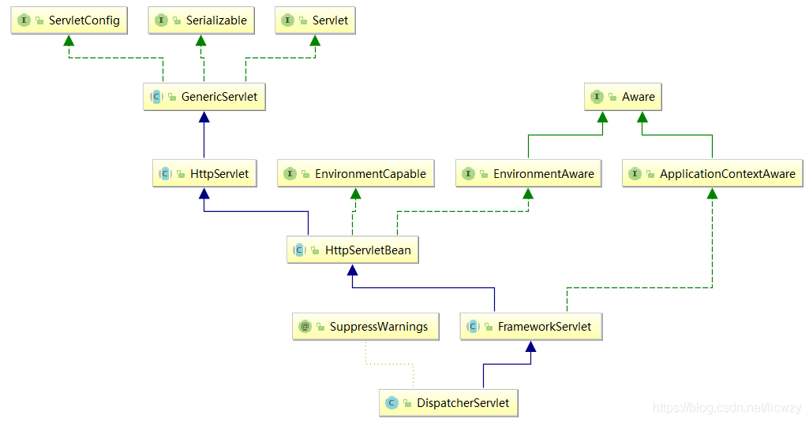
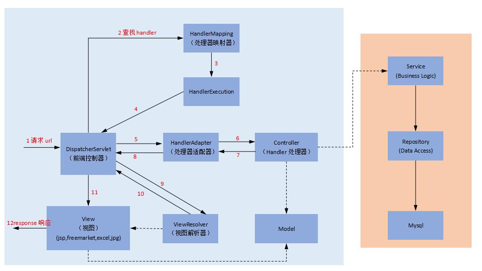
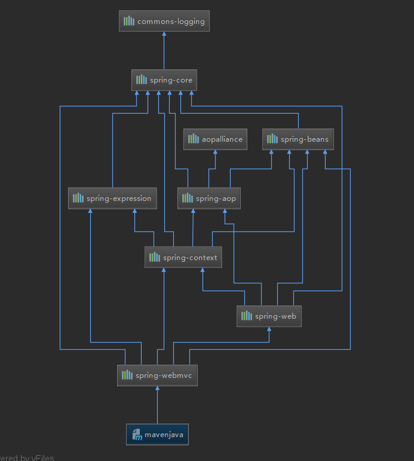

# SSM 框架集

**三层对应的处理框架：**

控制层 —— Servlet —— SpringMVC

业务层 —— Service类 —— Spring

持久层 —— dao类 —— MyBatis

## Spring的IOC和AOP

Spring是一个企业级应用框架，Spring框架的两大核心就是IOC和AOP

### IOC

Inversion of Control（控制反转），是面向对象编程的一种设计原则 —— 降低代码间耦合度

**控制反转理解：将原先由我们自己创建对象的过程交给Spring完成**

例：在一个类中创建对象

`UserDAO userDAO = new UserDaoImp();`

通过spring实现：

Maven依赖

```xml
<dependency>
    <groupId>org.springframework</groupId>
    <artifactId>spring-context</artifactId>
    <version>x.x.x</version>
</dependency>
```

虽然我们在这里仅仅引入了一个上下文的依赖包，但事实上Maven会根据这个包的依赖自动为我们导入相关的依赖内容

```xml
<?xml version="1.0" encoding="UTF-8"?>
<beans
        xmlns="http://www.springframework.org/schema/beans"
        xmlns:xsi="http://www.w3.org/2001/XMLSchema-instance"
        xsi:schemaLocation="
		http://www.springframework.org/schema/beans
		http://www.springframework.org/schema/beans/spring-beans.xsd">
    <!--将UserDaoImp这个实现类绑定一个id-->
    <bean id="userDao" class="com.spring.dao.UserDaoImp"/>
</beans>
```

```java
// 获取spring应用上下文（容器对象）
ApplicationContext context = new ClassPathXmlApplicationContext("spring.xml");
UserDAO userDAO = context.getBean("userDao", UserDAO.class);
```

*注：应用上下文是 Spring容器的一种抽象化表述。而我们常见的 ApplicationContext本质上说就是一个维护 Bean定义以及对象之间协作关系的高级接口*

#### Bean

1. Bean的创建

   ```xml
   <!--普通方法-->
   <bean id="userDao" class="com.spring.dao.UserDaoImp"/>
   ```

   ```xml
   <!--使用工厂方法创建对象-->
   <!--创建执行对象-->
   <bean id="factory" class="com.spring.Factory"/>
   <!--使用执行对象创建对象-->
   <bean id="userDao1" factory-bean="factory" factory-method="getUserDao1"
         class="com.spring.dao.UserDaoImp"/>
   <!--静态方法创建-->
   <bean id="userDao2" factory-method="getUserDao2"
         class="com.spring.Factory"/>
   ```

2. Bean的作用范围

   在Spring的<bean>标签中有一个scope属性，它的作用就是用来指定Bean对象的作用范围的

   | 属性值    | 描述                                               | 对象创建时机                                         |
   | --------- | -------------------------------------------------- | ---------------------------------------------------- |
   | singleton | 单例对象，即整个程序运行过程中仅创建一次对象，默认 | 创建Spring容器（ApplicationContext）时，就会创建对象 |
   | prototype | 多例对象，创建多个对象                             | getBean时才创建对象                                  |
   | request   | Web应用程序的一次请求                              |                                                      |
   | session   | Web应用程序的一次会话                              |                                                      |

3. Bean的生命周期

   | 属性           | 描述               |
   | -------------- | ------------------ |
   | init-method    | 对象初始化执行方法 |
   | destroy-method | 对象销毁执行方法   |

   *注：单例对象和多例对象的销毁时间不一样，单例对象在 spring容器被销毁时销毁，多例对象通过 Java垃圾回收机制销毁*

#### 依赖注入（DI）

> 概念：在项目中添加了Spring之后，代码中对象的管理都交给Spring完成，如果我们想要**在当前类中引用其他的类**，那么我们就需要添加相关的配置，由Spring为我们完成这些操作，类似这样的处理被称为依赖注入。
>
> 类型：基本类型、String、其他Bean、集合
>
> 实现：构造方法、Set方法、注解

```xml
<!--Set方法注入-->
<bean id="userService" class="com.service.UserServiceImp">
    <!--name的值是UserServiceImp类中被引用类的属性名-->
    <!--ref的值是被引用类的Bean-id-->
    <property name="userDAO" ref="userDao"/>
</bean>
```

##### 构造函数注入

Spring创建对象时，默认调用无参构造方法，若要调用有参构造方法，需要在<bean>标签下添加<constructor-arg>标签，设置构造方法的参数

```xml
<bean id="date" class="java.util.Date"/>
<bean id="user" class="com.entity.User">
    <constructor-arg name="id" value="12"/>
    <constructor-arg name="name" value="李华"/>
    <!--这里用的是ref而不是value，原因见下表-->
    <constructor-arg name="birthday" ref="date"/>
</bean>
```

<constructor-arg>标签的属性描述：

| 属性  | 描述                                                         |
| ----- | ------------------------------------------------------------ |
| type  | 依据数据类型为参数赋值，按照构造函数中参数的数据类型注入数据 |
| index | 按照参数的位置注入数据                                       |
| name  | 按照参数的名称注入数据                                       |
| ref   | 注入的数据如果是一个Bean对象，那么就需要使用这个属性指定关联的Bean，它的值是Bean的id |
| value | 参数具体注入的数据                                           |

##### Set方法注入

Set方法注入的形式使用更加广泛，不需要有参构造方法，但必须有setter方法

```xml
<bean id="date" class="java.util.Date"/>
<bean id="user" class="com.entity.User">
    <property name="id" value="12"/>
    <property name="name" value="李华"/>
    <property name="birthday" ref="date"/>
</bean>
```

##### 集合类型注入

```xml
<!--注入数组-->
<property name="arrs">
    <array>
        <value>值1</value>
        <value>值2</value>
    </array>
</property>
<!--注入List集合-->
<property name="list">
    <list>
        <value>值1</value>
        <value>值2</value>
    </list>
</property>
<!--注入Set集合-->
<property name="set">
    <set>
        <value>值1</value>
        <value>值2</value>
    </set>
</property>
<!--注入Map-->
<property name="map">
    <map>
        <entry key="键1" value="值1"></entry>
        <entry key="键2" value="值2"></entry>
    </map>
</property>
```

#### 注解替代XML配置

使用注解开发之前，需要修改配置文件：

```xml
<context:component-scan base-package="包名"/>
```

这段配置内容的含义是告诉Spring在运行时需要扫描的包，这些包中会包含注解，也就是说如果你声明注解的类并没有包含在这段配置的范围内，那么程序在运行的过程中不会进行扫描，相关的设置不会发生作用。

```xml
<?xml version="1.0" encoding="UTF-8"?>
<beans 
	xmlns="http://www.springframework.org/schema/beans"
	xmlns:xsi="http://www.w3.org/2001/XMLSchema-instance"
	xmlns:context="http://www.springframework.org/schema/context"
	xsi:schemaLocation="
		http://www.springframework.org/schema/beans
		http://www.springframework.org/schema/beans/spring-beans.xsd
		http://www.springframework.org/schema/context
		http://www.springframework.org/schema/context/spring-context.xsd">
</beans>
```

上述配置内容新增了context相关的约束文件

##### 创建对象

| 注解        | 描述                                                   |
| ----------- | ------------------------------------------------------ |
| @Component  | 通用注解，用于将当前类作为一个Bean对象                 |
| @Repository | 一般用于数据处理层（持久层）对象的创建，但是没有强限制 |
| @Service    | 一般用于业务层对象的创建，但是没有强限制               |
| @Controller | 一般用于控制层对象的创建，但是没有强限制               |

这是Spring中提供给我们使用的四个用于创建对象的注解，它们的作用和<bean>是一样的。需要注意的是，Component是一个通用的注解，其他三个则是为了清楚的体现分层的思想而设置的，但却并没有强制要求我们必须用在对应的地方（最好用在对应的地方）。

```java
// 没有指定Bean-id，默认以添加注解类的类名userDaoImp作为Bean-id（首字母小写）
@Component
public class UserDaoImp implements UserDAO

// 指定Bean-id为userDao
@Component("userDao")
public class UserDaoImp implements UserDAO
```

##### 注入数据

| 注解       | 描述                                                         |
| ---------- | ------------------------------------------------------------ |
| @Autowired | 依据**数据类型**自动注入                                     |
| @Qualifier | 需要和@Autowired结合起来一起使用，先通过类型确定可以选择注入的数据，然后再通过value属性指定注入的属性名称 |
| @Resource  | 依据Bean-id注入数据，使用name属性指定Bean-id                 |
| @Value     | 为基本数据类型和String类型的内容注入数据                     |

**@Autowired注解的特殊情况：**

```java
@Repository("userDao1")
public class UserDaoImp1 implements UserDAO {
    
}
@Repository("userDao2")
public class UserDaoImp2 implements UserDAO {
    
}
```

```java
@Component
public class UserServiceImp implements UserSER {
    @Autowired
    private UserDAO userDAO; // 会报错，因为找不到userDAO这个实现类
```

当有多个实现类是同一数据类型时，只使用@Autowired可能会导致错误，此时需要@Qualifier来指定具体属性名

```java
@Component
public class UserServiceImp implements UserSER {
    @Autowired
    @Qualifier(value="userDao1")
    private UserDAO userDAO;
```

**Spring的自动注入规则：**

> 首先，如果在Spring容器中并没有可以供Spring选择的注入对象，那么程序运行时会出现异常；
>
> 第二，如果在Spring容器中有且仅有一个可以供Spring选择的对象，那么它会将这个对象注入到相应的位置，保证程序正常运行；
>
> 第三，如果在Spring容器中有多个可以选择的对象，那么自动注入的时候会优先依据数据类型判断可以选择的对象，然后再选择和属性名称相同的对象注入。

**Spring注解依赖注入的三种方式：**

1. 通过构造器来注入
2. 通过setter方法来注入
3. 通过filed变量来注入（直接写在成员变量上）

*注：当使用 filed变量来注入时，不写对应 getter、setter方法，Spring会通过 Java的“反射机制”来实现属性的依赖注入*

<font color="#ff0000">总结：</font>

1. 强制性的依赖性或者当目标不可变时，使用构造函数注入（**应该说尽量都使用构造器来注入**）
2. 可选或多变的依赖使用setter注入（**建议可以使用构造器结合setter的方式来注入**）
3. 在大多数的情况下避免field域注入（**虽然这个方式写起来非常简便，但是它的弊端确实远大于这些优点**）

##### 作用范围

```java
@Component("userService")
// 指定当前Bean对象的作用域，作用和<bean>的scope属性一样
@Scope("prototype")
public class UserServiceImp implements UserSER
```

#### 无配置开发

[Spring 5 无配置开发](https://www.cnblogs.com/destiny-log/p/14355748.html)

### AOP

Aspect Oriented Programming（面向切面编程），它通过**预编译**和**动态代理**实现程序功能的统一维护，在开发中使用AOP可以对业务逻辑的各个部分进行隔离，从而使业务逻辑各部分之间耦合度降低，提高程序的可重用性。

AOP被认为是OOP（面向对象编程）的延续，和OOP一样都是一种编程思想，所以它并不是Spring独有的概念。

开发中使用AOP的好处：

1. 减少开发中重复的代码，让代码更加整洁
2. 将重复的代码抽离成了公用的代码，所以开发人员不必再重复编写那些内容，提高了开发效率
3. 减少重复代码降低了后期维护的难度

**AOP相关概念：**

- 连接点（JoinPoint）：程序执行的某个特定位置，在Spring中指的是方法执行的前后，因为Spring的AOP仅仅支持方法

- 切入点（PointCut）：程序需要进行处理的点，一个项目中有很多的类，一个类中有很多个连接点，当我们需要在某个方法前插入一段增强（advice）代码时，我们就需要使用切点信息来确定，要在哪些连接点上增强

  **需要处理的连接点就是切入点**

- 通知/增强（Advice）：在拦截到连接点之后执行相关的处理（我们想要实现的功能），在Spring中这些增强被分为五大类，前置通知，后置通知，异常通知，最终通知，环绕通知

- 切面（Aspect）：切入点和通知的结合

- 目标对象（Target）：被通知的对象（需要被插入通用代码片段的方法），也就是初始的业务逻辑，在毫不知情的情况下，被我们织入切面，而自己专注于业务本身的逻辑

- 织入（Weaving）：将增强添加到目标类具体连接点上的过程，在Spring中实现这个过程采用动态代理的方式

#### AOP的使用

Maven依赖

```xml
<dependency>
    <groupId>org.aspectj</groupId>
    <artifactId>aspectjweaver</artifactId>
    <version>x.x.x</version>
</dependency>
```

```xml
<?xml version="1.0" encoding="UTF-8"?>
<beans 
	xmlns="http://www.springframework.org/schema/beans"
	xmlns:xsi="http://www.w3.org/2001/XMLSchema-instance"
	xmlns:context="http://www.springframework.org/schema/context"
    xmlns:aop="http://www.springframework.org/schema/aop"
	xsi:schemaLocation="
		http://www.springframework.org/schema/beans
		http://www.springframework.org/schema/beans/spring-beans.xsd
		http://www.springframework.org/schema/context
		http://www.springframework.org/schema/context/spring-context.xsd
        http://www.springframework.org/schema/aop
        http://www.springframework.org/schema/aop/spring-aop.xsd">
</beans>
```

上述配置内容新增了aop相关的约束文件

| 节点                | 名称     | 备注                 |
| ------------------- | -------- | -------------------- |
| aop:before          | 前置通知 | 在方法执行之前增强   |
| aop:after-returning | 后置通知 | 在方法执行之后增强   |
| aop:after-throwing  | 异常通知 | 在方法出现异常时增强 |
| aop:after           | 最终通知 | 在方法完成之后增强   |
| aop:around          | 环绕通知 | 在整个方法执行中增强 |

*注：五种增强类型的执行顺序为，前置通知$\rightarrow$执行方法$\rightarrow$异常通知$\rightarrow$后置通知$\rightarrow$最终通知*

#### AOP配置优化

```xml
<aop:config>
    <aop:aspect id="自定义id" ref="AOP处理类id">
        <aop:before method="处理方法" pointcut="execution(切入点表达式)"/>
        <aop:after-returning method="处理方法" pointcut="execution(切入点表达式)"/>
        <aop:after-throwing method="处理方法" pointcut="execution(切入点表达式)"/>
        <aop:after method="处理方法" pointcut="execution(切入点表达式)"/>
    </aop:aspect>
</aop:config>
```

配置切入点表达式：

```xml
<aop:config>
    <!--aop:aspect可以有多个，若将aop:pointcut放在aop:config标签下，可以供多个切面使用-->
    <aop:aspect id="test" ref="log">
        <aop:pointcut id="p" expression="execution(public void com.service.UserServiceImp.add())"/>
        <aop:before method="before" pointcut-ref="p"/>
        <aop:after-returning method="after" pointcut-ref="p"/>
        <aop:after-throwing method="throwing" pointcut-ref="p"/>
        <aop:after method="end" pointcut-ref="p"/>
    </aop:aspect>
</aop:config>
```

#### 切入点表达式

> 标准格式：访问修饰符 返回值 [包名].类名.方法名(参数类型)

1. 可以不加访问修饰符

2. 可以用通配符*来替代返回值

3. 通配符*可以替代任意包名（不常用）

   **更习惯采用的形式：包名..类名.方法名(参数类型)，以..的形式指代当前目录以及子目录**

4. 通配符*可以替代类/方法名

5. 通配符*可以替代参数（不常用，必须保证方法是有参数的，否则增强不会产生效果）

   **更习惯采用的形式：包名.类名.方法名(..)，用..取代*，不论方法有没有参数都可以匹配**

#### 特别的环绕通知

```xml
<aop:config>
    <aop:aspect id="test" ref="log">
        <aop:pointcut id="p" expression="execution(public void com.service.UserServiceImp.add())"/>
        <aop:around method="around" pointcut-ref="p"/>
    </aop:aspect>
</aop:config>
```

```java
public class Logger {
    // 环绕通知会在切入点方法执行之前拦截，并且环绕通知是有返回值的
    public Object around(ProceedingJoinPoint p) {
        Object resl = null;
        try {
            System.out.println("数据开始处理"); // 前置通知
            resl = p.proceed(p.getArgs()); // 获取返回值
            System.out.println("数据处理完成"); // 后置通知
        } catch (Throwable throwable) {
            throwable.printStackTrace();
            System.out.println("数据处理出现异常"); // 异常通知
        } finally {
            System.out.println("数据操作已完结"); // 最终通知
            return resl;
        }
    }
}
```

通过上述代码，我们可以发现，环绕通知中包含了其他四种通知类型，这并不难理解，AOP被称为是面向切面编程，之前的四种配置把可能遇到的情况都解决了，而环绕通知其实就是Spring为我们提供的一个可以用于自定义处理的一种方式。

#### 注解处理AOP

```xml
<!--开启注解扫描-->
<context:component-scan base-package="包名"/>
<!--开启AOP支持-->
<aop:aspectj-autoproxy/>
```

```java
@Component // 把当前类作为一个Bean对象
@Aspect
public class Logger {

    @Pointcut("execution(public void com.service.UserServiceImp.add())")
    public void point() {

    }

    @Before("point()")
    public void before() {
        System.out.println("数据开始处理了");
    }

    @AfterReturning("point()")
    public void after() {
        System.out.println("数据处理完成了");
    }

    @After("point()")
    public void end() {
        System.out.println("数据操作已完结");
    }

    @AfterThrowing("point()")
    public void throwing() {
        System.out.println("数据处理出现异常");
    }

    @Around("point()")
    public Object around(ProceedingJoinPoint p) {
        Object resl = null;
        try {
            System.out.println("数据开始处理");
            resl = p.proceed(p.getArgs());
            System.out.println("数据处理完成");
        } catch (Throwable throwable) {
            throwable.printStackTrace();
            System.out.println("数据处理出现异常");
        } finally {
            System.out.println("数据操作完结");
            return resl;
        }
    }
}

```

| 注解            | 描述                       |
| --------------- | -------------------------- |
| @Aspect         | 将当前类作为一个注解处理类 |
| @Pointcut       | 指定切入点表达式           |
| @Before         | 将当前方法作为前置通知     |
| @AfterReturning | 将当前方法作为后置通知     |
| @AfterThrowing  | 将当前方法作为异常通知     |
| @After          | 将当前方法作为最终通知     |
| @Around         | 将当前方法作为环绕通知     |

## SpringMVC

**什么是MVC ？**

MVC：模型（dao，service） 视图（html） 控制器（servlet）

[jsp为什么被淘汰了？](https://www.zhihu.com/question/328713931)

**MVC框架要做哪些事情：**

1. 将url映射到java类或java类的方法
2. 封装用户提交的数据
3. 处理请求——调用相关的业务处理——封装响应数据
4. 将响应数据进行渲染

Spring MVC是Spring Framework的一部分，是基于Java实现MVC的轻量级web框架

**Spring的web框架围绕DispatcherServlet（调度Servlet）设计**



DispatcherServlet本质上也是一个Servlet，其中有一个doService方法，是所有请求的入口

**SpringMVC执行原理**



### SpringMVC的使用

Maven依赖

```xml
<dependency>
     <groupId>org.springframework</groupId>
     <artifactId>spring-webmvc</artifactId>
     <version>x.x.x</version>
</dependency>
```

使用spring和springmvc只用导入一个依赖信息即可，其他spring所需依赖会自动导入



**web.xml**

```xml
<!--配置DispatcherServlet，SpringMVC的核心-->
<servlet>
    <servlet-name>springmvc</servlet-name>
    <servlet-class>org.springframework.web.servlet.DispatcherServlet</servlet-class>
    <!--DispatcherServlet要绑定Spring的配置文件-->
    <init-param>
        <param-name>contextConfigLocation</param-name>
        <param-value>classpath:springmvc-servlet.xml</param-value>
    </init-param>
    <!--设置启动级别，启动级别为1，则服务器启动即加载DispatcherServlet-->
    <load-on-startup>1</load-on-startup>
</servlet>
<servlet-mapping>
    <servlet-name>springmvc</servlet-name>
    <!--'/'和'/*'是有区别的，'/'只匹配所有的请求，不匹配jsp，'/*'匹配所有请求，包括jsp-->
    <url-pattern>/</url-pattern>
</servlet-mapping>
```

**springmvc-servlet.xml**

**配置文件开发**

```xml
<?xml version="1.0" encoding="UTF-8"?>
<beans
        xmlns="http://www.springframework.org/schema/beans"
        xmlns:xsi="http://www.w3.org/2001/XMLSchema-instance"
        xsi:schemaLocation="
		http://www.springframework.org/schema/beans
		http://www.springframework.org/schema/beans/spring-beans.xsd">
    <!--处理器映射器-->
    <bean class="org.springframework.web.servlet.handler.BeanNameUrlHandlerMapping"/>
    <!--处理器适配器-->
    <bean class="org.springframework.web.servlet.mvc.SimpleControllerHandlerAdapter"/>
    <!--前后端分离，不需要配置视图解析器-->
    <!--视图解析器：模板引擎 Thymeleaf Freemarker...-->
    <bean class="org.springframework.web.servlet.view.InternalResourceViewResolver" id="internalResourceViewResolver">
        <!--前缀-->
        <property name="prefix" value="/WEB-INF/jsp/"/>
        <!--后缀-->
        <property name="suffix" value=".jsp"/>
    </bean>
    <!--控制器-->
	<bean id="/hello" class="com.springmvc.controller.HelloController"/>
</beans>
```

```java
// 使用配置文件开发，必须要实现Controller接口中的handleRequest方法，但可以不返回视图，在方法中处理请求并响应
public class HelloController implements Controller {
    @Override
    public ModelAndView handleRequest(HttpServletRequest httpServletRequest, HttpServletResponse httpServletResponse) throws Exception {
        // 通过httpServletResponse设置响应内容
        httpServletResponse.getWriter().write("{\"status\" = \"ok\"}");
        return null;
    }
}
```

**注解开发**

```xml
<?xml version="1.0" encoding="UTF-8"?>
<beans xmlns="http://www.springframework.org/schema/beans"
       xmlns:xsi="http://www.w3.org/2001/XMLSchema-instance"
       xmlns:context="http://www.springframework.org/schema/context"
       xmlns:mvc="http://www.springframework.org/schema/mvc"
       xsi:schemaLocation="http://www.springframework.org/schema/beans
       http://www.springframework.org/schema/beans/spring-beans.xsd
       http://www.springframework.org/schema/context
       https://www.springframework.org/schema/context/spring-context.xsd
       http://www.springframework.org/schema/mvc
       https://www.springframework.org/schema/mvc/spring-mvc.xsd">

    <!--开启注解扫描-->
    <context:component-scan base-package="com.springmvc.controller"/>
    <!--开启注解支持-->
    <mvc:annotation-driven/>
    <!--视图解析器-->
    <bean class="org.springframework.web.servlet.view.InternalResourceViewResolver"
          id="internalResourceViewResolver">
        <property name="prefix" value="/WEB-INF/jsp/"/>
        <property name="suffix" value=".jsp"/>
    </bean>
</beans>
```

- 创建Controller类

  使用@Controller定义控制器

- @RequestMapping

  将url映射到Controller类/方法

```java
@Controller
@RequestMapping("/hello") // 可不设置
public class HelloController {
    /**访问地址：ip:端口/项目名/hello/h1
     *
     * @param model 添加数据
     * @return 需要跳转的jsp页面名称
     */
    @RequestMapping("/h1")
    public String hello(Model model) {
        // 封装数据
        model.addAttribute("msg", "hellofasf");
        // 回被视图解析器处理,返回需要跳转的jsp页面名称
        // WEB-INF/jsp/hello.jsp
        return "hello";
    }
}
```

### 处理静态资源

**静态资源为什么会被拦截 ？**

当我们把web应用部署到Tomcat服务器上时，服务器会先加载全局的web.xml（CATALINA_HOME/conf/web.xml），然后才会加载我们自己web项目中的web.xml，当我们将`url-pattern`配置成` <url-pattern>/</url-pattern>`时，会覆盖掉全局web.xml中对静态资源的处理

- 方式一

使用Tomcat中的defaultServlet来处理静态资源

```xml
<!--在web.xml中配置defaultServlet来处理静态资源-->
<servlet-mapping>
    <servlet-name>default</servlet-name>
    <url-pattern>*.html</url-pattern>
</servlet-mapping>
<servlet-mapping>
    <servlet-name>default</servlet-name>
    <url-pattern>*.jsp</url-pattern>
</servlet-mapping>
```

defaultServlet为Tomcat默认创建的Servlet，可以直接使用

- 方式二

在SpringMVC的配置文件中添加`<mvc:default-servlet-handler/>`，会直接将所有静态资源转发到defaultServlet中

- 方式三

自定义静态资源路径

```xml
<!--location表示资源所在的路径，相对于webapp目录，mapping则是路径的匹配规则-->
<mvc:resources location="/html/" mapping="/html/**"/>
<mvc:resources location="/images/" mapping="/images/**"/>
```

通常会将方式二和方式三结合使用

### RESTful风格

RESTful就是一个资源定位及资源操作的风格，不是标准也不是协议，只是一种风格。基于这个风格设计的软件更简洁，更有层次，更易于实现缓存等机制

传统风格：`http://127.0.0.1:8080/add?a=1&b=2`

RESTful：`http://127.0.0.1:8080/add/a/b`

**使用RESTful操作资源：**可以通过不同的请求方式来实现不同的效果。如下：请求地址一样，但是功能可以不同

- `http://127.0.0.1/item/1`    查询 GET
- `http://127.0.0.1/item`    新增 POST
- `http://127.0.0.1/item`    更新 PUT
- `http://127.0.0.1/item/1`    删除 DELETE

**限定请求方式：**

1. 方式一

```java
@RequestMapping(value = "/restful/{a}/{b}", method = RequestMethod.GET)
```

2. 方式二

```java
@GetMapping("/restful/{a}/{b}")
@PostMapping("/restful/{a}/{b}")
@PutMapping("/restful/{a}/{b}")
@DeleteMapping("/restful/{a}/{b}")
```

**@PathVariable注解**

SpringMVC中可以使用@PathVariable，让方法参数的值对应绑定到一个URI模板变量上

```java
@RequestMapping("/restful/{a}/{b}")
public String restful(@PathVariable int a, @PathVariable int b)
```

### 重定向和转发

- 没有视图解析器实现，需要注释掉视图解析器

```java
return "/index.jsp"; // 转发

return "forward:/index.jsp"; // 转发

return "redirect:/index.jsp"; // 重定向
```

- 有视图解析器

```java
return "test"; // 需要转发到的另一个页面

return "redirect:/index.jsp"; // 重定向
```

### 接收数据

- 前端传递的参数名与后端的变量名相同

```java
@RequestMapping("xxx")
public String func(String name) {
    // ip:端口?name=xxx
    // name会自动接收到
    return "xxx";
}
```

- 传递的参数名和后端变量名不同

```java
@RequestMapping("xxx")
public String func(@RequestParam("username") String name) {
    // ip:端口?username=xxx
    // name会自动接收到
    return "xxx";
}
```

- 传递的是一个对象，会自动匹配User对象中的属性名和表单名，如果相同，则自动封装

```java
@RequestMapping("xxx")
public String func(User user) {
      // ip:端口?id=xxx&name=xxx
      // name会自动接收到
    return "xxx";
}
```

### 中文乱码问题

配置过滤器（Spring已经实现了一个）

```xml
<!--处理乱码-->
<filter>
    <filter-name>encoding</filter-name>
    <filter-class>org.springframework.web.filter.CharacterEncodingFilter</filter-class>
</filter>
<filter-mapping>
    <filter-name>encoding</filter-name>
    <url-pattern>/*</url-pattern>
</filter-mapping>
```

### Controller 返回 JSON

- 使用@ResponseBody作用在方法上，则该方法不会走视图解析器，会直接返回字符串

- 使用@RestController替换@Controller表示当前类的所有方法都不走视图解析器

#### Jackson使用

```java
@Controller
public class JsonController {

    @RequestMapping("/j1")
    @ResponseBody
    public String json() throws JsonProcessingException {
        User user = new User("李华",20, "男");
        ObjectMapper mapper = new ObjectMapper();
        // 将user对象转为json字符串
        String str = mapper.writeValueAsString(user);
        return str;
    }
}
```

#### Fastjson使用

Maven依赖

```xml
<dependency>
    <groupId>com.alibaba</groupId>
    <artifactId>fastjson</artifactId>
    <version>x.x.x</version>
</dependency>
```

```java
@RequestMapping(value = "/j2", produces = "application/json;charset=utf-8")
@ResponseBody
public String json2() {
    List<User> users = new ArrayList<>();
    users.add(new User("李华", 20, "女"));
    users.add(new User("李华", 20, "女"));
    users.add(new User("李华", 20, "女"));
    users.add(new User("李华", 20, "女"));
    users.add(new User("李华", 20, "女"));
    users.add(new User("李华", 20, "女"));
    users.add(new User("李华", 20, "女"));
    return JSON.toJSONString(users);
}
```

#### 解决json乱码

```xml
<!--解决json乱码-->
<mvc:annotation-driven>
    <mvc:message-converters register-defaults="true">
        <!--指定编码-->
        <bean class="org.springframework.http.converter.StringHttpMessageConverter">
            <constructor-arg value="UTF-8"/>
        </bean>
        <!--指定用哪个框架来转成json-->
        <bean class="org.springframework.http.converter.json.MappingJackson2HttpMessageConverter">
            <property name="objectMapper">
                <bean class="org.springframework.http.converter.json.Jackson2ObjectMapperFactoryBean">
                    <property name="failOnEmptyBeans" value="false"/>
                </bean>
            </property>
        </bean>
    </mvc:message-converters>
</mvc:annotation-driven>
```

## MyBatis

MyBatis免除了几乎所有的JDBC代码以及设置参数和获取结果集的工作

Maven依赖

```xml
<!--MySQL JDBC-->
<dependency>
    <groupId>mysql</groupId>
    <artifactId>mysql-connector-java</artifactId>
    <version>x.x.x</version>
</dependency>
<!--MyBatis-->
<dependency>
    <groupId>org.mybatis</groupId>
    <artifactId>mybatis</artifactId>
    <version>x.x.x</version>
</dependency>
```

### 从 XML 中构建 SqlSessionFactory

> XML 配置文件中包含了对 MyBatis 系统的核心设置，包括获取数据库连接实例的数据源（DataSource）以及决定事务作用域和控制方式的事务管理器（TransactionManager）

mybatis-config.xml

```xml
<?xml version="1.0" encoding="UTF-8" ?>
<!DOCTYPE configuration
        PUBLIC "-//mybatis.org//DTD Config 3.0//EN"
        "http://mybatis.org/dtd/mybatis-3-config.dtd">
<configuration>
    <environments default="development">
        <environment id="development">
            <transactionManager type="JDBC"/>
            <dataSource type="POOLED">
                <!--配置连接对象（DataSource）-->
            	<property name="driver" value="com.mysql.jdbc.Driver"/>
                <property name="url" value="jdbc:mysql://localhost:3306/test"/>
                <property name="username" value="root"/>
                <property name="password" value="root"/>
            </dataSource>
        </environment>
    </environments>
    <!--这些配置会告诉MyBatis去哪里找映射文件-->
    <mappers>
        <!--设置UserDao接口对应的配置文件在resources目录下的相对路径-->
        <mapper resource="com/mybatis/dao/UserDao.xml"/>
    </mappers>
</configuration>
```

> 每个基于 MyBatis 的应用都是以一个 SqlSessionFactory 的实例为核心的。SqlSessionFactory 的实例可以通过 SqlSessionFactoryBuilder 获得。而 SqlSessionFactoryBuilder 则可以从 XML 配置文件或一个预先配置的 Configuration 实例来构建出 SqlSessionFactory 实例。

```java
// 该路径为资源目录（resources）下的相对路径
String resource = "org/mybatis/example/mybatis-config.xml";
// 获取配置文件输入流
InputStream inputStream = Resources.getResourceAsStream(resource);
// 传入配置文件输入流，读取配置文件，创建SqlSessionFactory对象
SqlSessionFactory sqlSessionFactory = new SqlSessionFactoryBuilder().build(inputStream);
```

### SQL语句映射

一个语句既可以通过 XML 定义，也可以通过注解定义

假设有一个接口：

```java
// 接口中定义了数据库的操作方法
public interface UserDao {
    List<User> findAll();
    User findById(int id);
    User findByUser(User user);
    User findByMap(Map userMap);
    
    User findByCondition(int id, String username);
    User findByCondition(@Param("id") int id, @Param("username") String username); // 使用@Param来设置参数名

}
```

#### XML 定义SQL语句

UserDao.xml

```xml
<?xml version="1.0" encoding="UTF-8" ?>
<!DOCTYPE mapper
        PUBLIC "-//mybatis.org//DTD Mapper 3.0//EN"
        "http://mybatis.org/dtd/mybatis-3-mapper.dtd">
<!--命名空间的主要作用：接口绑定-->
<mapper namespace="com.mybatis.dao.UserDao">
    <!--设置UserDao接口中的findAll()方法映射的SQL语句-->
    <!--id为需要实现的对应方法名，resultType为结果集对象类型-->
    <select id="findAll" resultType="com.mybatis.pojo.User">
        select * from staffs
    </select>
    
    <!--方法有一个参数，该参数为基本类型-->
    <select id="findById" resultType="com.mybatis.pojo.User">
        select * from staffs where id = #{id}
    </select>
    <!--方法有一个参数，该参数为User对象-->
    <select id="findByUser" resultType="com.mybatis.pojo.User">
        select * from staffs where id = #{id} and username = #{username}
    </select>
    <!--方法有一个参数，该参数为Map对象-->
    <select id="findByMap" resultType="com.mybatis.pojo.User">
        select * from staffs where id = #{id} and username = #{username}
    </select>
    
    <!--方法有多个参数-->
    <!--使用了@Param来设置参数名-->
    <select id="findByCondition" resultType="com.mybatis.pojo.User">
        select * from staffs where id = #{id} and username = #{username}
    </select>
    <!--没有使用@Param来设置参数名，使用对应的默认key来获取值-->
    <!--{arg0=1, arg2="Zhangsan", param1=1, param2="Zhangsan"}-->
    <select id="findByCondition" resultType="com.mybatis.pojo.User">
        select * from staffs where id = #{param1} and username = #{param2}
    </select>
    
</mapper>
```

#### 注解完成SQL语句映射

- 在mybatis-config.xml中配置mapper接口所在的包名

```xml
<!--将包内的映射器接口实现全部注册为映射器-->
<mappers>
    <package name="com.mybatis.dao"/>
</mappers>
```

- 在接口对应方法上使用注解来配置需要执行的SQL

```java
public interface UserDao {
    @Select("select * from staffs")
    List<User> findAll();

    @Select("select * from staffs where id = #{id}")
    User findById(int id);

    @Select("select * from staffs where id = #{id} and username = #{username}\n")
    User findByUser(User user);

    @Select("select * from staffs where id = #{id} and username = #{username}\n")
    User findByCondition(@Param("id") int id, @Param("username") String username);

    @Insert("insert into staffs values (null, #{username}, #{age}, #{address})\n")
    void addUser(User user);
    
    @Delete("delete from staffs where id = #{id}")
    void deleteById(int id);
    
    @Update("update staffs set age = #{age} , address = #{address} where username = #{username}\n")
    void updateUser(User user);
}
```

*注：#{}是预编译的，可以防止 SQL 注入攻击*

### 从 SqlSessionFactory 中获取 SqlSession

> 既然有了 SqlSessionFactory，顾名思义，我们可以从中获得 SqlSession 的实例。SqlSession 提供了在数据库执行 SQL 命令所需的所有方法。你可以通过 SqlSession 实例来直接执行已映射的 SQL 语句。

- 方法一

```java
// 将获取SqlSession对象的语句放在try中，可以自动close，释放资源
// SqlSession对象可以理解为一个数据库连接对象
try (SqlSession session = sqlSessionFactory.openSession()) {
    List<User> res = (List<User>) session.selectOne("com.mybatis.dao.UserDao.findAll");
}
```

- 方法二

```java
try (SqlSession session = sqlSessionFactory.openSession()) {
    UserDao mapper = session.getMapper(UserDao.class); // 获取UserDao实现类对象
    List<User> res = mapper.findAll();
}
```

> 第二种方法有很多优势，首先它不依赖于字符串字面值，会更安全一点；其次，如果你的 IDE 有代码补全功能，那么代码补全可以帮你快速选择到映射好的 SQL 语句。

### MyBatis实现增删改查

#### 新增

`void addUser(User user)`

```xml
<insert id="addUser">
    insert into staffs values (null, #{username}, #{age}, #{address})
</insert>
```

```java
mapper.addUser(new User("yxp", 20, "CDC"));
// openSession()创建出来的连接，不会自动提交
// openSession(true)会自动提交事务
session.commit();
```

#### 删除

`void deleteById(int id);`

```xml
<delete id="deleteById">
    delete from staffs where id = #{id}
</delete>
```

```java
mapper.deleteById(4);
session.commit();
```

#### 修改

`void updateUser(User user);`

```xml
<update id="updateUser">
    update staffs set age = #{age} , address = #{address} where username = #{username}
</update>
```

```java
mapper.updateUser(new User("Lisi", 23, "苏州"));
session.commit();
```

### 配置 jdbc.properties

```properties
jdbc.driver = com.mysql.jdbc.Driver
jdbc.url = jdbc:mysql://localhost:3306/test
jdbc.username = root
jdbc.password = root
```

```xml
<properties resource="jdbc.properties"/>
<!--这些属性可以在外部进行配置，并可以进行动态替换。可以在properties元素的子元素中设置，更具灵活性-->
<property name="driver" value="${jdbc.driver}"/>
<property name="url" value="${jdbc.url}"/>
<property name="username" value="${jdbc.username}"/>
<property name="password" value="${jdbc.password}"/>
```

### 动态SQL

根据传入的参数情况动态的生成SQL语句，MyBatis提供了动态SQL相关的标签让我们使用

#### if 标签

if标签进行条件判断，条件成立才会把if标签中的内容拼接进SQL语句中

```xml
<select id="findByCondition" resultType="com.mybatis.pojo.User">
    select * from staffs
    where id = #{id}
    <if test="username != null">
        and username = #{username}
    </if>
</select>
```

#### trim 标签

trim标签可以动态的添加前缀/后缀，或者动态的消除前缀/后缀

- prefixOverrides属性

用来设置需要被清除的前缀，多个值可以用|分隔，注意|前后不能有空格

```xml
<select id="findByCondition" resultType="com.mybatis.pojo.User">
    select * from staffs
    <trim prefixOverrides="and|or">
        and
    </trim>
</select>
```

最终执行SQL为：`select * from staffs`

- suffixOverrides

用来设置需要被清除的后缀

```xml
<select id="findByCondition" resultType="com.mybatis.pojo.User">
    select * from staffs
    <trim suffixOverrides="like|or">
        where id = #{id} or
    </trim>
</select>
```

最终执行SQL为：`select * from staffs where id = #{id}`

- prefix

设置动态添加前缀

```xml
<select id="findByCondition" resultType="com.mybatis.pojo.User">
    select * from staffs
    <trim prefix="where">
        id = #{id}
    </trim>
</select>
```

最终执行SQL为：`select * from staffs where id = #{id}`

- suffix

设置动态添加后缀

```xml
<select id="findByCondition" resultType="com.mybatis.pojo.User">
    select * from staffs
    <trim prefix="id = #{id}">
        where
    </trim>
</select>
```

最终执行SQL为：`select * from staffs where id = #{id}`

- 动态添加前缀where，并且消除前缀and或者or

```xml
<select id="findByCondition" resultType="com.mybatis.pojo.User">
    select * from staffs
    <trim prefix="where" prefixOverrides="and|or">
        <if test="id != null">
            id = #{id}
        </if>
        <if test="username != null">
            and username = #{username}
        </if>
    </trim>
</select>
```

调用方法时，如果传入的id和username都为null，则执行SQL为：`select * from staffs`

调用方法时，如果传入的id为null，username不为null，则执行SQL为：`select * from staffs where username = #{username}`

##### where 标签

where标签等价于：

```xml
<trim prefix="where" prefixOverrides="and|or"></trim>
```

##### set 标签

set标签等价于：

```xml
<trim prefix="set" suffixOverrides=","></trim>
```

```xml
<update id="updateUser">
    update staffs
    <set>
        <if test="username != null">
            username = #{username},
        </if>
        <if test="age != null">
            age = #{age},
        </if>
        <if test="address != null">
            address #{address},
        </if>
    </set>
    where id = #{id}
</update>
```

如果调用方法时传入的User对象的id为2，username不为null，其他属性都为null，则最终执行的SQL为：`update staffs set username = ? where id = ?`

#### choose、when、otherwise

> 有时候，我们不想使用所有的条件，而只是想从多个条件中选择一个使用。针对这种情况，MyBatis 提供了 choose 元素，它有点像 Java 中的 switch 语句。

```xml
<select id="selectChose" resultType="com.mybatis.pojo.User">
    select * from staffs
    <where>
        <choose>
            <when test="id != null">
            	id = #{id}
        	</when>
        	<when test="username != null">
            	username = #{username}
        	</when>
        	<otherwise>
            	id = 3
        	</otherwise>
    	</choose>
    </where>
</select>
```

如果User对象的id不为null，就通过id查询；

如果id为null，username不为null，就通过username查询；

如果id和username都为null，就查询id为3的用户

#### foreach 标签

> 动态 SQL 的另一个常见使用场景是对集合进行遍历（尤其是在构建 IN 条件语句的时候）

```java
// 查询某几个id的用户
List<User> findByIds(@Param("ids") int[] ids);
```

```xml
<select id="findByIds" resultType="com.mybatis.pojo.User">
    select *
 	from staffs
  	where id in
  	<foreach item="item" index="index" collection="list"
             open="(" separator="," close=")">
        #{item}
  	</foreach>
</select>
```

> 你可以将任何可迭代对象（如 List、Set 等）、Map 对象或者数组对象作为集合参数传递给 *foreach*。当使用可迭代对象或者数组时，index 是当前迭代的序号，item 的值是本次迭代获取到的元素。当使用 Map 对象（或者 Map.Entry 对象的集合）时，index 是键，item 是值。

### 结果映射 resultMap

使用resultMap标签来自定义结果集和实体类属性的映射规则

```xml
<!--
	resultMap：用来自定义结果集和实体类的映射
		属性：
			id：该resultMap的唯一标识
			type：用来指定映射到哪个实体类 
	id：用来指定主键列的映射规则
		属性：
			property：要映射的属性名
			column：对应的列名
	result：用来指定普通列的映射规则
		属性：
			property：要映射的属性名
			column：对应的列名
-->
<resultMap id="orderMap" type="com.mybatis.pojo.Order">
    <id column="id" property="id"/>
    <result column="createtime" property="createtime"/>
    <result column="price" property="price"/>
    <result column="remark" property="remark"/>
    <result column="user_id" property="userId"/>
</resultMap>
<!--使用自定义的映射规则-->
<select id="findAll" resultMap="orderMap">
    select id,createtime,price,remark,user_id from orders
</select>
```

**自动映射**

自动映射默认情况下是开启状态的，也就是说，如果结果集的列名和对象的属性名相同是会自动映射的，我们只需要写特殊情况的映射关系即可

```xml
<resultMap id="orderMap" type="com.mybatis.pojo.Order">
    <result column="user_id" property="userId"/>
</resultMap>
```

如有需要可以选择关闭自动映射

```xml
<resultMap id="orderMap" type="com.mybatis.pojo.Order" autoMapping="false">
    <id column="id" property="id"/>
    <result column="createtime" property="createtime"/>
    <result column="price" property="price"/>
    <result column="remark" property="remark"/>
    <result column="user_id" property="userId"/>
</resultMap>
```

*注：有些情况下是需要关闭自动映射的，尤其是在多表关联查询的时候*

